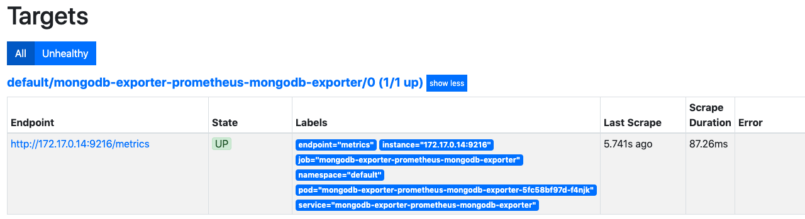
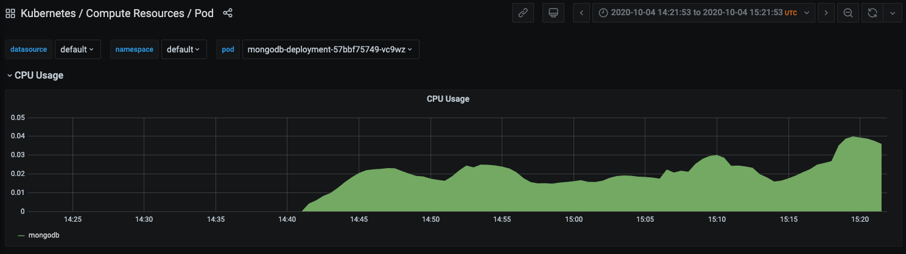

# promfana
Demo involving Prometheus and Grafana


## Setup Minikube /w Helm Addon
If you don't have minikube already installed, [click here](https://kubernetes.io/docs/tasks/tools/install-minikube/)

If you already do, proceed.
```
minikube config set memory 8192
minikube config set cpus 4
minikube start
minikube addons enable helm-tiller
```
> If you want to see a dashboard, you can open up a new terminal, set your kubeconfig to point to `[minikube:default]` and execute `minikube dashboard`


# Install Prometheus

## Via Helm
```
helm repo add prometheus-community https://prometheus-community.github.io/helm-charts

helm repo add stable https://kubernetes-charts.storage.googleapis.com/

helm repo update

helm install --name prometheus prometheus-community/kube-prometheus-stack

```
> If you mess up and need to delete the deployment, clean up CRD's first before you do the `helm delete`
```
kubectl delete crd prometheuses.monitoring.coreos.com
kubectl delete crd prometheusrules.monitoring.coreos.com
kubectl delete crd servicemonitors.monitoring.coreos.com
kubectl delete crd podmonitors.monitoring.coreos.com
kubectl delete crd alertmanagers.monitoring.coreos.com
kubectl delete crd thanosrulers.monitoring.coreos.com

helm delete --purge prometheus
```

## What did you deploy? 
- StatefulSets
```
statefulset.apps/alertmanager-prometheus-kube-prometheus-alertmanager 
statefulset.apps/prometheus-prometheus-kube-prometheus-prometheus    
```
    2 stateful sets that handle the prometheus-server-operator and prometheus-alert-manager
- Deployments
```
deployment.apps/prometheus-grafana            
deployment.apps/prometheus-kube-prometheus-operator
deployment.apps/prometheus-kube-state-metrics
```
    The operator is the core deployment, grafana is the visualization layer, and kube-state-metrics is a dependency helm-chart, that helps scrape the k8 components (monitors cluster health, so k8s monitoring out of the box!)
- ReplicaSets
```
replicaset.apps/prometheus-grafana-6c8f78659c
replicaset.apps/prometheus-kube-prometheus-operator-7f5947767f
replicaset.apps/prometheus-kube-state-metrics-6df5d44568
```
- DaemonSet
```
daemonset.apps/prometheus-prometheus-node-exporter
```
    DaemonSet a component that runs on every k8s worker node
    This particular one connects to the prom-server and translates
    the worker-node metrics (CPU, load etc) to prometheus-metrics

- Pods and Svcs, use `kubectl get pods` and `kubectl get svc`
- Configmaps `kubectl get configmap`
```
configs for different parts 
managed by the operator
how to default metrics
```
- Secrets : `kubectl get secrets`
```
holds secrets for Prometheus, Grafana, Operator, Certs, Passwords, etc.
```
- [Custom Resource Definitions](https://kubernetes.io/docs/concepts/extend-kubernetes/api-extension/custom-resources/#customresourcedefinitions) (CRDs) : `kubectl get crd` ; Each CRD has a description field, that you can read into [here](https://github.com/prometheus-community/helm-charts/tree/main/charts/kube-prometheus-stack/crds)

- Containers
```
- quay.io/prometheus/prometheus:v2.18.2 : the main one, has mounted volumes that hold the config, alert and cert directories
- quay.io/coreos/prometheus-config-reloader:v0.38.1 : helps reload configs
- docker.io/jimmidyson/configmap-reload:v0.3.0 : helps reload the rules
```
More info found @ `prom-manifests/prom.yaml` and `prom-manifests/alert.yaml`
- Config and Rules files : `prom-manifests/config-secret.yaml` (it's b64 encoded, so decode it appropriately) and `prom-manifests/rules.yaml`

## UI

- Grafana UI: `kubectl port-forward deployment/prometheus-grafana 3000`
- Promethues UI: `kubectl port-forward prometheus-prometheus-kube-prometheus-prometheus-0 9090`

## Register your app
There is a sample server app, the manifests for which can be found in `k8s-mongodb` folder. 
I'm going to expose that app's metrics and get it registered onto to prometheus so 
that I can let it scrape the `/metrics` endpoint and set up a simple dashboard in grafana.

Prometheus uses service-monitor identify and track the app which is "registered"

```
serviceMonitorSelector:
    matchLabels:
        release: <app-svc-label>
```

- To get your app registered, 
```
- exporter : exposes /metrics endpoint
- service  : so that prometheus can connect to the exporter
- serviceMonitor : to tell Prometheus to scrape the app
```

- Exporter : It's the translation layer between the data that app exposes and the format the prometheus expects it to be. It fetches metrics from your app pod, translates it and exposes the `/metrics` endpoint for Prometheus to scrape. It's separate thing from your application deployments.

## Register the mongodb app to Prometheus

### Install the exporter
```
helm install --name mongodb-exporter prometheus-community/prometheus-mongodb-exporter -f prom-manifests/mongodb-exporter-values.yaml
```
which should give you :
```
==> v1/Deployment
mongodb-exporter-prometheus-mongodb-exporter          

==> v1/Pod(related)                                                   
mongodb-exporter-prometheus-mongodb-exporter-5fc58bf97d-f4njk  

==> v1/Secret
mongodb-exporter-prometheus-mongodb-exporter

==> v1/Service
mongodb-exporter-prometheus-mongodb-exporter  ClusterIP  10.105.14.106       9216/TCP  1s

==> v1/ServiceAccount
mongodb-exporter-prometheus-mongodb-exporter

==> v1/ServiceMonitor
mongodb-exporter-prometheus-mongodb-exporter  1s
```

### Check the Endpoint of the exporter
```
kubectl port-forward service/mongodb-exporter-prometheus-mongodb-exporter 9216

curl -I http://localhost:9216/metrics

    HTTP/1.1 200 OK
    Content-Type: text/plain; version=0.0.4; charset=utf-8
    Date: Sun, 04 Oct 2020 14:52:23 GMT
```
You could also just browse to http://localhost:9216/metrics to see the metrics in text.

### Verify in Prometheus
```
kubectl port-forward prometheus-prometheus-kube-prometheus-prometheus-0 9090
```
Browse to `http://localhost:9090/targets` and look for `default/mongodb-exporter-prometheus-mongodb-exporter/0 (1/1 up)`



### Verify in Grafana
```
kubectl port-forward deployment/prometheus-grafana 3000
```

Browse to `http://localhost:3000/` and login with `admin:prom-operator`

To check Pod resources for MongoDB, browse to 
`
http://localhost:3000/dashboards?query=Kubernetes%20%2F%20Compute%20Resources%20%2F%20Pod
`
and filter by pod-name `mongodb-deployment-#somenumber`


# Cleanup
`minkube stop`
`minikube delete`

